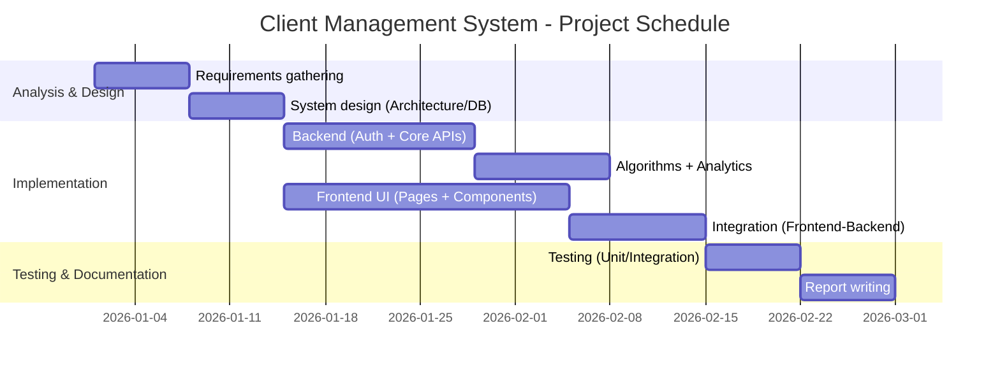
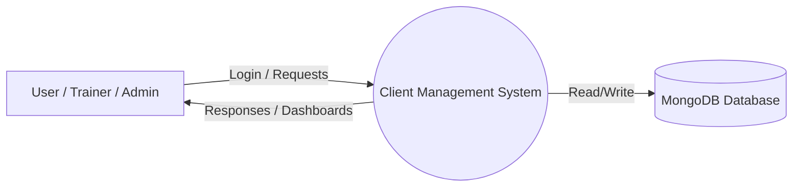
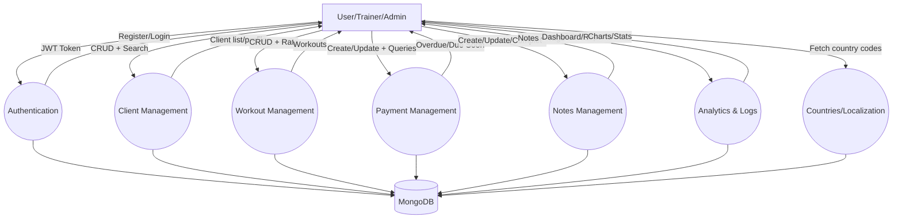
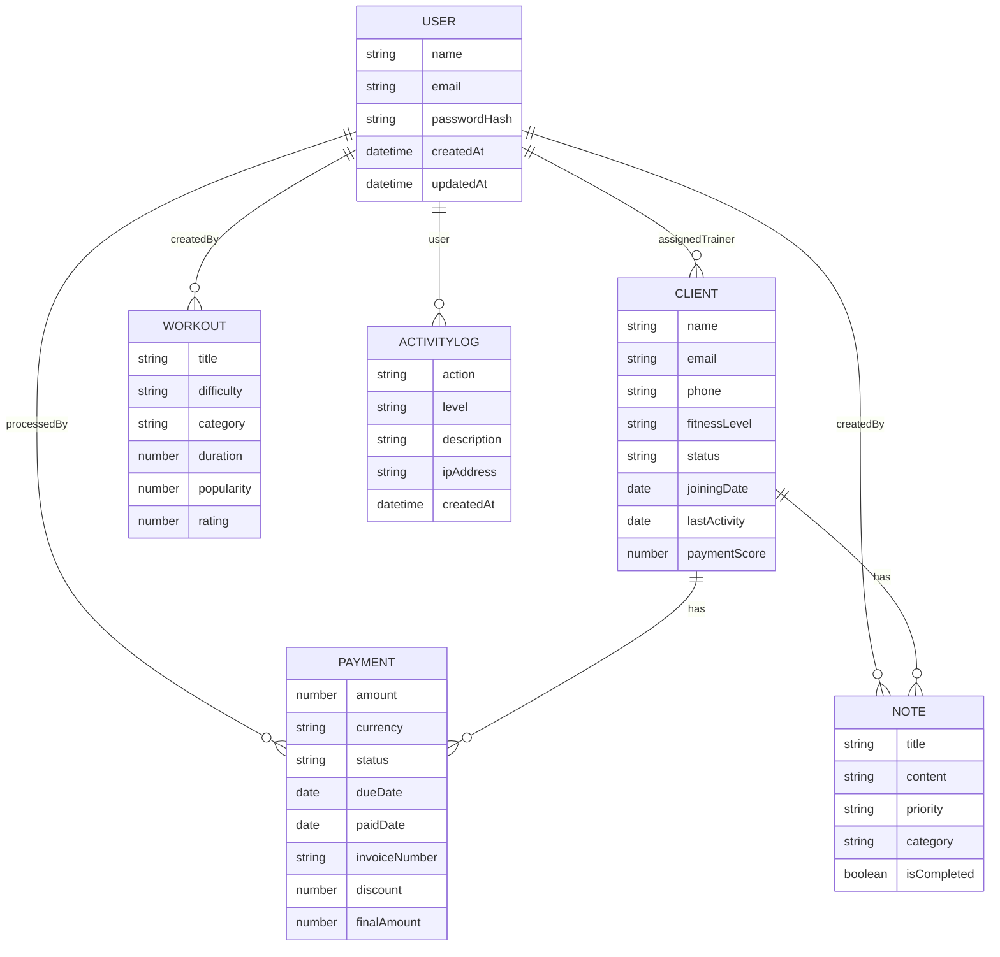
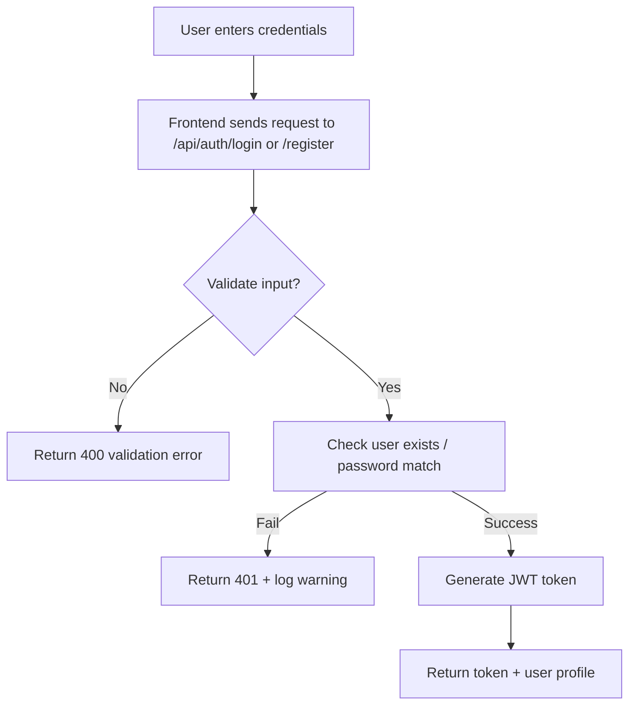
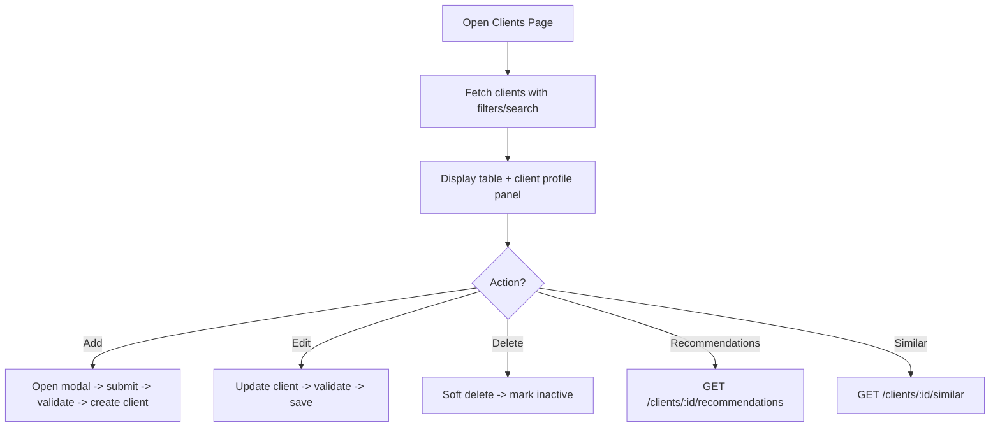
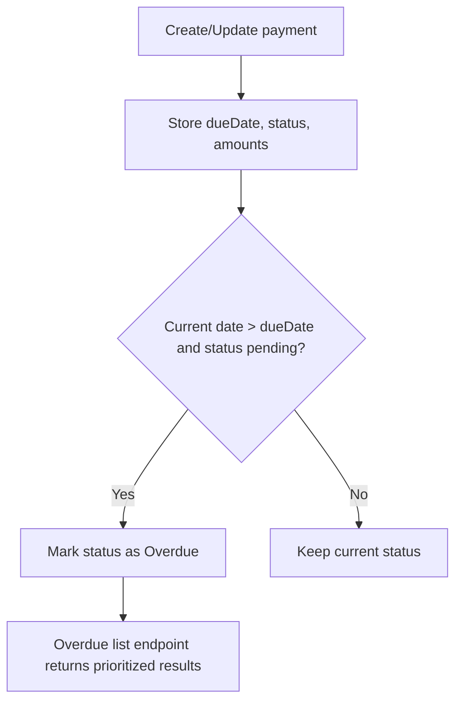

# Client Management System
## Project Report

**Project Title:** Client Management System (CMS) with Analytics & Recommendation  
**Submitted By:** **Bipin Baral** and **Sudan Tandan**  
**Program/Department:** **Bachelor in Computer Application (BCA)**  
**College/University:** **Sagarmatha College of Science and Technology**  
**Submitted To (Supervisor):** **Manis Aryal**  
**Submission Date:** **Feb 2026**  

---

## Preliminary Pages

### Title Page
**Client Management System (CMS) with Analytics & Recommendation — Project Report**  
Submitted by **Bipin Baral** and **Sudan Tandan** to **Sagarmatha College of Science and Technology** in partial fulfillment of the requirements for **Bachelor in Computer Application (BCA)**.  

### Disclaimer
I hereby declare that this project report titled **“Client Management System (CMS) with Analytics & Recommendation”** is my/our original work. All sources of information used in this report have been duly acknowledged. This report has not been submitted to any other institution for any academic award.

**Signature:** ____________________  
**Name:** **Bipin Baral** and **Sudan Tandan**  
**Date:** **Feb 2026**  

### Supervisor’s Recommendation
This is to certify that the project report entitled **“Client Management System (CMS) with Analytics & Recommendation”** submitted by *[Your Name]* has been prepared under my supervision and is recommended for evaluation.

This is to certify that the project report entitled **“Client Management System (CMS) with Analytics & Recommendation”** submitted by **Bipin Baral** and **Sudan Tandan** has been prepared under my supervision and is recommended for evaluation.

**Supervisor:** **Manis Aryal**  
**Signature:** ____________________  
**Date:** **Feb 2026**  

### Certificate of Approval
This project report entitled **“Client Management System (CMS) with Analytics & Recommendation”** submitted by **Bipin Baral** and **Sudan Tandan** is approved in partial fulfillment of the requirement for the degree/program **Bachelor in Computer Application (BCA)**.

| Committee/Authority | Name | Signature | Date |
|---|---|---|---|
| Supervisor | **Manis Aryal** |  |  |
| Examiner | *[Name]* |  |  |
| Head/Coordinator | *[Name]* |  |  |

### Acknowledgement
We would like to express our sincere gratitude to our supervisor **Manis Aryal** for guidance and continuous support. We also thank our department, friends, and family for their encouragement during the completion of this project.

### Abstract
The **Client Management System (CMS)** is a web-based application designed to manage client profiles, workouts, payments, and notes for service providers such as trainers/freelancers, while also offering administrative insights through analytics and activity logs. The system consists of a **Next.js (App Router) frontend** and a **Node.js/Express backend** connected to **MongoDB** using **Mongoose**. Security is handled through **JWT-based authentication**, password hashing using **bcrypt**, request validation using **express-validator**, and protection against abuse through **rate limiting**.  
Key capabilities include client CRUD operations with fuzzy search, workout management with rating, payment tracking with overdue/due-soon analytics, note-taking with tagging and completion, and dashboard analytics including trends and forecasting. Localization support includes **Nepal-specific phone validation** and default currency handling (NPR). This report presents the problem context, objectives, system analysis, design, implementation, and testing outcomes, along with future enhancement recommendations.

### Table of Contents
- Preliminary Pages
- Chapter 1: Introduction
- Chapter 2: Background Study and Literature Review
- Chapter 3: System Analysis
- Chapter 4: System Design
- Chapter 5: Implementation and Testing
- Chapter 6: Conclusion and Future Recommendation
- Chapter 7: Appendix
- Chapter 8: References

### List of Figures
- **Figure 3.1:** DFD Level 0 (Context Diagram)
- **Figure 3.2:** DFD Level 1 (Main Processes)
- **Figure 3.3:** Entity Relationship (ER) Diagram (Logical Data Model)
- **Figure 3.4:** Gantt Chart (Project Schedule)
- **Figure 4.1:** System Architecture (Frontend–Backend–Database)
- **Figure 4.2:** Authentication Flow (Login/Register)
- **Figure 4.3:** Client Management Flowchart
- **Figure 4.4:** Payment Overdue Detection Flow

### List of Tables
- **Table 1.1:** Report Organization
- **Table 3.1:** Functional Requirements
- **Table 3.2:** Feasibility Study Summary
- **Table 5.1:** Test Cases (Sample)

### Abbreviations
- **API**: Application Programming Interface  
- **CMS**: Client Management System  
- **CRUD**: Create, Read, Update, Delete  
- **DFD**: Data Flow Diagram  
- **ER**: Entity Relationship  
- **JWT**: JSON Web Token  
- **RBAC**: Role-Based Access Control  
- **REST**: Representational State Transfer  
- **TTL**: Time To Live (automatic expiry)  
- **UI/UX**: User Interface / User Experience  

---

## Chapter 1: Introduction

### 1.1 Introduction
Client-oriented businesses (e.g., training, freelancing, service providers) require organized handling of client data, service history, payments, and communications. Manual processes using spreadsheets and scattered notes often lead to inconsistency, missed follow-ups, and delayed payments. The proposed **Client Management System (CMS)** provides a centralized and secure platform to manage clients, create workouts/programs, maintain notes, track payments (including overdue cases), and derive insights from analytics.

### 1.2 Problem Statement
Existing client handling methods commonly face the following issues:
- Fragmented records (client info, workouts, and payments stored in different places)
- Lack of reliable overdue payment tracking and reminders
- Limited insight into growth, revenue trends, and client activity
- Inefficient search when client lists grow large (typos and partial matches)
- Weak security practices in ad-hoc systems (no authentication, no logging)

### 1.3 Objectives
**General Objective:**  
To develop a secure, web-based client management system with analytics and recommendation features.

**Specific Objectives:**
- Provide authentication using JWT and secure password hashing
- Manage client profiles with advanced search and filtering
- Manage workouts and support rating to improve recommendations
- Track payments and detect overdue/due-soon payments with analytics
- Store structured notes with tags, priority, and completion workflow
- Provide analytics dashboards (client activity, revenue trends, logs)
- Maintain activity logs for auditing and monitoring
- Support Nepal localization (phone validation and NPR default currency)

### 1.4 Scope
The scope of this project includes:
- **Frontend (Next.js):** Public pages, authentication pages, dashboard pages, admin panel UI, reusable UI components.
- **Backend (Express):** REST API endpoints for authentication, clients, workouts, payments, notes, analytics, and countries.
- **Database (MongoDB):** Persistent storage for users, clients, workouts, payments, notes, and activity logs.
- **Algorithms:** Fuzzy search, activity scoring, KNN-based similarity/recommendations, priority queue for overdue payments, trend forecasting.

Out of scope (current version):
- Real-time messaging / chat
- Production deployment with CI/CD
- Third-party payment gateway integration
- Multi-tenant organization accounts

### 1.5 Limitations
- The frontend currently contains **static/mock UI data** for many dashboards; full API integration can be extended.
- In-memory rate limit store is used (recommended: Redis in production).
- Admin authentication in UI is currently represented as static credentials in the frontend summary; production-grade admin auth should be backend-driven.
- Recommendation and forecasting quality depends on available data volume.

### 1.6 Development Methodology
This project follows the **Waterfall Model** because requirements and module boundaries (auth, clients, payments, workouts, notes, analytics) are clear and can be implemented in sequential phases.

#### 1.6.1 Waterfall Model
Phases:
1. Requirements gathering and analysis
2. System design (architecture + database + interface design)
3. Implementation (backend and frontend modules)
4. Integration and testing
5. Deployment (local environment) and documentation

### 1.7 Report Organization
Table 1.1 summarizes how this report is structured.

| Chapter | Title | Description |
|---|---|---|
| 1 | Introduction | Problem, objectives, scope, methodology |
| 2 | Background & Literature Review | Related systems and supporting technologies |
| 3 | System Analysis | Requirements, feasibility, DFD, ER, schedule |
| 4 | System Design | Architecture, design approach, flowcharts |
| 5 | Implementation & Testing | Environment, module implementation, tests |
| 6 | Conclusion & Future Work | Outcomes, improvements |
| 7 | Appendix | Screenshots, configuration samples |
| 8 | References | Books, papers, documentation links |

---

## Chapter 2: Background Study and Literature Review

### 2.1 Background Study
Client management platforms (CRM-like systems) are widely used to store client details and track engagements. In fitness and service contexts, additional domain needs include program/workout assignment, progress notes, and recurring payments. Modern web systems typically use a frontend framework (React/Next.js) connected to a backend API (Node.js/Express) and a database (MongoDB/SQL).

### 2.2 Literature Review
This project is influenced by best practices and concepts from:
- **JWT Authentication**: Stateless session handling for APIs; tokens passed via `Authorization: Bearer <token>`.
- **Password Hashing (bcrypt)**: One-way hashing and salting of passwords to prevent plaintext storage.
- **MongoDB + Mongoose**: Flexible document storage for evolving requirements, schema modeling, and indexing.
- **REST API Design**: Clear endpoints and status codes; pagination/filtering for large datasets.
- **Fuzzy Search (Fuse.js / Levenshtein)**: Improves UX by allowing typo-tolerant search.
- **K-Nearest Neighbors (KNN)**: Similarity-based recommendations (e.g., similar clients; workout suggestions).
- **Trend Forecasting**: Using linear regression and moving average smoothing to interpret revenue trends.
- **Rate Limiting**: Prevent brute force and API abuse by limiting requests per IP and per endpoint type.

---

## Chapter 3: System Analysis

### 3.1 Requirement Analysis
The system requirements were derived from the core problems: secure login, managing client lifecycle, tracking workouts, tracking payments and due dates, note-taking, and analytics reporting.

#### 3.1.1 Functional Requirements
Table 3.1 lists the primary functional requirements.

| ID | Requirement | Description |
|---|---|---|
| FR-01 | User registration | Register a user with name/email/password |
| FR-02 | User login | Login and receive JWT token |
| FR-03 | Client management | Add/update/view/soft-delete clients |
| FR-04 | Client search | Fuzzy search clients by name/email/phone |
| FR-05 | Inactive clients | Identify clients inactive for 7+ days |
| FR-06 | Workout management | CRUD workouts; filter/search workouts |
| FR-07 | Workout rating | Rate workouts (1–5) and store metrics |
| FR-08 | Recommendations | Recommend workouts and find similar clients |
| FR-09 | Payment management | Create/update/view payments with invoices |
| FR-10 | Overdue detection | List overdue payments and prioritize them |
| FR-11 | Notes management | CRUD notes with tags/priority/completion |
| FR-12 | Analytics dashboard | Provide aggregated statistics and trends |
| FR-13 | Activity logs | Record and query activity logs for auditing |
| FR-14 | Localization | Nepal phone validation; default currency NPR |

#### 3.1.2 Non-Functional Requirements (Summary)
- **Security:** JWT auth, bcrypt hashing, validation, and logging
- **Performance:** Indexing for search and analytics, pagination support
- **Reliability:** Centralized error handling and consistent API responses
- **Maintainability:** Modular backend structure (routes/controllers/models/middleware)
- **Usability:** Responsive UI components and dashboard navigation

### 3.2 Feasibility Study

#### 3.2.1 Technical Feasibility
Technologies used are widely supported and suitable:
- Node.js + Express for REST APIs
- MongoDB + Mongoose for scalable document storage
- Next.js + React + Tailwind CSS for modern UI/UX
- JWT/bcrypt for standard security practices

#### 3.2.2 Operational Feasibility
The system reduces manual workload by centralizing client records, payments, and notes. Dashboards and analytics improve decision-making and follow-ups.

#### 3.2.3 Economic Feasibility
The system is cost-effective for development and deployment:
- Open-source technologies (Node, Next, MongoDB community)
- Local deployment possible without cloud costs
- Can scale to production later with managed hosting and database services

**Table 3.2: Feasibility Study Summary**

| Feasibility Type | Result | Notes |
|---|---|---|
| Technical | Feasible | Stable ecosystem; modular design |
| Operational | Feasible | Improves workflow; reduces errors |
| Economic | Feasible | Low cost; open-source stack |

### 3.3 Schedule (Gantt Chart)
Figure 3.4 provides a sample schedule (can be adjusted to match your actual timeline).

### 3.4 System Analysis
The system is a client–server web application:
- **Frontend** provides routes for public pages, authentication, dashboard features, and admin panels.
- **Backend API** handles authentication, business logic, algorithms, and database access.
- **Database** stores entities and supports analytics via indexes and aggregations.

### 3.5 Data Flow Diagram (DFD)

#### 3.5.1 DFD Level 0 (Context Diagram)
Figure 3.1 shows the system context. External users interact with the CMS to manage data; the system stores and retrieves information from the database.

#### 3.5.2 DFD Level 1 (Main Processes)
Figure 3.2 expands the main processes.

### 3.6 Entity Relationship (ER) Diagram
Although MongoDB is document-based, the logical data model can be represented as an ER diagram based on Mongoose schemas.

**Key Entities (Collections):**
- `User`
- `Client` (references `User` as `assignedTrainer`)
- `Workout` (references `User` as `createdBy`)
- `Payment` (references `Client` and optionally `User` as `processedBy`)
- `Note` (references `Client` and `User`)
- `ActivityLog` (references `User` and stores entity metadata)

---

## Chapter 4: System Design

### 4.1 System Design Overview
The system follows a **three-tier architecture**:
- **Presentation Layer:** Next.js frontend (UI pages, components, navigation)
- **Application Layer:** Express backend (business logic, security, algorithms)
- **Data Layer:** MongoDB (persistent data storage, indexes, analytics)

### 4.2 Methodology of the Proposed System
The proposed system uses:
- REST API for communication between frontend and backend
- JWT-based stateless authentication
- Validation middleware for data integrity
- Rate limiting to prevent brute-force and abuse
- Modular separation of concerns (routes/controllers/models/middleware)

### 4.3 Flowcharts

#### 4.3.1 Authentication Flow (Login/Register)
Figure 4.2 illustrates the authentication process.

#### 4.3.2 Client Management Flowchart
Figure 4.3 shows the workflow for managing clients.

#### 4.3.3 Payment Overdue Detection Flow
Figure 4.4 describes overdue identification.

### 4.4 Working Mechanism and Tools
**Frontend Tools**
- Next.js (App Router), React, TypeScript
- TailwindCSS v4, Radix UI primitives, Lucide icons
- Chart.js + react-chartjs-2 for dashboard charts

**Backend Tools**
- Node.js + Express
- MongoDB + Mongoose
- JWT, bcryptjs
- express-validator, Joi (available)
- express-rate-limit
- node-cron (available for scheduled tasks)
- fuse.js for fuzzy search

---

## Chapter 5: Implementation and Testing

### 5.1 System Implementation

#### 5.1.1 Development Environment Setup
**Backend**
- Location: `backend/`
- Run:
  - `npm install`
  - Create `.env` from `.env.example`
  - `npm run dev` (nodemon)

**Frontend**
- Location: `frontend/`
- Run:
  - `npm install` or `pnpm install`
  - `pnpm dev` or `npm run dev`

#### 5.1.2 Admin Module Development (Frontend UI)
The frontend includes an admin panel UI under routes such as:
- `/admin` (dashboard)
- `/admin/users` (user management UI)
- `/admin/reports` (report placeholders)
- `/admin/logs` (activity log UI)
- `/admin/settings` (configuration UI)

#### 5.1.3 Client Module Development
Backend endpoints (protected):
- `GET /api/clients` (search/filter + pagination)
- `POST /api/clients`
- `GET /api/clients/:id`
- `PUT /api/clients/:id`
- `DELETE /api/clients/:id` (soft delete / inactive)
- `GET /api/clients/inactive`
- `GET /api/clients/:id/recommendations`
- `GET /api/clients/:id/similar`

Frontend pages (dashboard UI):
- `/clients` and related dashboard routes under `app/(dashboard)/...`

#### 5.1.4 Database Design and Integration
MongoDB collections and key relationships were implemented using Mongoose models:
- `Client` stores profile, fitness data, status, and derived metrics (BMI/activity score).
- `Workout` stores workouts, metrics, and creator reference.
- `Payment` stores billing records including invoice numbers and overdue logic.
- `Note` stores structured notes per client with tags and completion.
- `ActivityLog` stores audit logs with TTL (90 days).

Indexes were added for performance (text search and filtering).

#### 5.1.5 System Integration
Integration is performed via REST API calls from frontend to backend:
- JWT stored client-side (recommended in httpOnly cookies for production)
- Auth header: `Authorization: Bearer <token>`
- Backend middleware `protect` verifies token and injects `req.user`

### 5.2 Testing

#### 5.2.1 Unit Testing (Conceptual)
Unit tests focus on:
- Validation rules (email/phone/password)
- Model methods (activity score, invoice generation, overdue calculation)
- Algorithm utilities (fuzzy search, similarity scoring, forecasting)

#### 5.2.2 Integration Testing
Integration tests verify end-to-end API flows using tools like Postman/Thunder Client:
- Register -> Login -> access protected endpoints
- Create Client -> Create Payment -> query overdue/due-soon
- Create Workout -> Rate Workout -> verify rating metrics
- Create Note -> mark complete -> verify state change

**Table 5.1: Sample Test Cases**

| Test ID | Scenario | Input | Expected Output |
|---|---|---|---|
| TC-01 | Register user | Valid name/email/password | 201 + JWT token |
| TC-02 | Login user | Correct credentials | 200 + JWT token |
| TC-03 | Create client | Valid Nepal phone `98xxxxxxxx` | 201 created |
| TC-04 | Create client invalid phone | `9601234567` | 400 validation error |
| TC-05 | Create payment with past dueDate | dueDate < today | status becomes Overdue |
| TC-06 | Fetch overdue payments | GET `/payments/overdue` | prioritized list |

---

## Chapter 6: Conclusion and Future Recommendation

### 6.1 Conclusion
The Client Management System successfully delivers a structured solution for managing client data, workouts, payments, and notes, backed by a secure and scalable REST API. The use of JWT authentication, validation, activity logging, and rate limiting improves security and reliability. Analytics endpoints and implemented algorithms (fuzzy search, activity scoring, recommendations, forecasting) enhance decision-making and operational follow-up. Localization support for Nepal makes the system suitable for local use cases.

### 6.2 Future Recommendations
- Full frontend-to-backend integration across all pages (replace mock data)
- Use **httpOnly cookies** and refresh tokens for improved auth security
- Add role field to `User` model and enforce RBAC across admin endpoints
- Add file uploads (profile images, attachments) using cloud storage
- Add notifications (email/SMS) for overdue payments and reminders
- Add CI/CD pipeline and production deployment (Vercel + managed MongoDB)
- Add automated testing suite (Jest/Supertest) and API contract tests
- Introduce caching for analytics endpoints (Redis) for performance

---

## Chapter 7: Appendix

### A.1 System Screenshots
Insert screenshots here (replace placeholders):
- Login Page (`/auth/login`)
- Signup Page (`/auth/signup`)
- Dashboard (`/dashboard`)
- Clients Page (`/clients`)
- Workouts Page (`/workouts`)
- Payments Page (`/payments`)
- Notes Page (`/notes`)
- Admin Dashboard (`/admin`)

*(Tip: In Word, use “Insert → Pictures”, then add a caption like “Figure A.1: Login Page”.)*

### A.2 Sample Environment File (Backend)
Copy from `backend/.env.example` and fill values:
- `MONGO_URI=mongodb://localhost:27017/client-management`
- `JWT_SECRET=...`
- `PORT=5000`

### A.3 Key API Routes (Summary)
Base URL: `http://localhost:5000/api`
- Auth: `/auth/login`, `/auth/register`
- Clients: `/clients`, `/clients/inactive`, `/clients/:id/recommendations`, `/clients/:id/similar`
- Workouts: `/workouts`, `/workouts/recommend/:clientId`, `/workouts/:id/rate`
- Payments: `/payments`, `/payments/overdue`, `/payments/due-soon`, `/payments/analytics`
- Notes: `/notes`, `/notes/tags`, `/notes/:id/complete`
- Analytics: `/analytics/dashboard`, `/analytics/revenue/trends`, `/analytics/logs`, etc.
- Countries: `/countries`, `/countries/code/:code`

---

## Chapter 8: References
1. Next.js Documentation. (`https://nextjs.org/docs`)
2. Express.js Documentation. (`https://expressjs.com/`)
3. MongoDB Documentation. (`https://www.mongodb.com/docs/`)
4. Mongoose Documentation. (`https://mongoosejs.com/docs/guide.html`)
5. JSON Web Token (JWT). RFC 7519. (`https://www.rfc-editor.org/rfc/rfc7519`)
6. bcrypt password hashing overview. (`https://en.wikipedia.org/wiki/Bcrypt`)
7. Fuse.js (Fuzzy Search). (`https://fusejs.io/`)
8. Tailwind CSS Documentation. (`https://tailwindcss.com/docs`)
9. OWASP Authentication Cheat Sheet. (`https://cheatsheetseries.owasp.org/cheatsheets/Authentication_Cheat_Sheet.html`)

